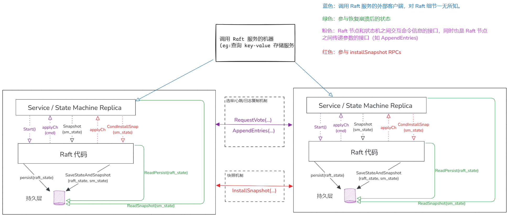
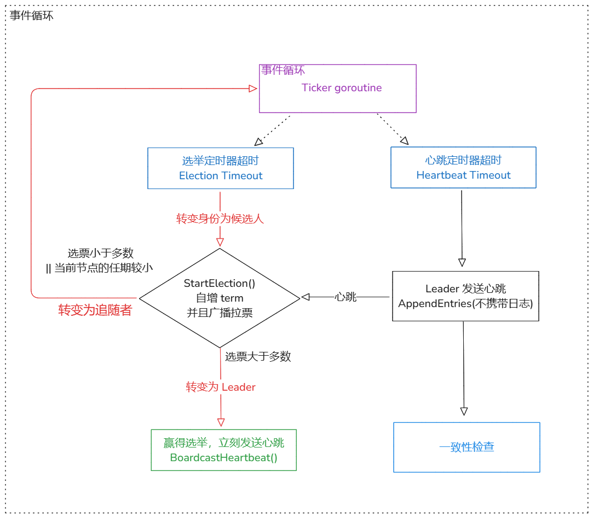
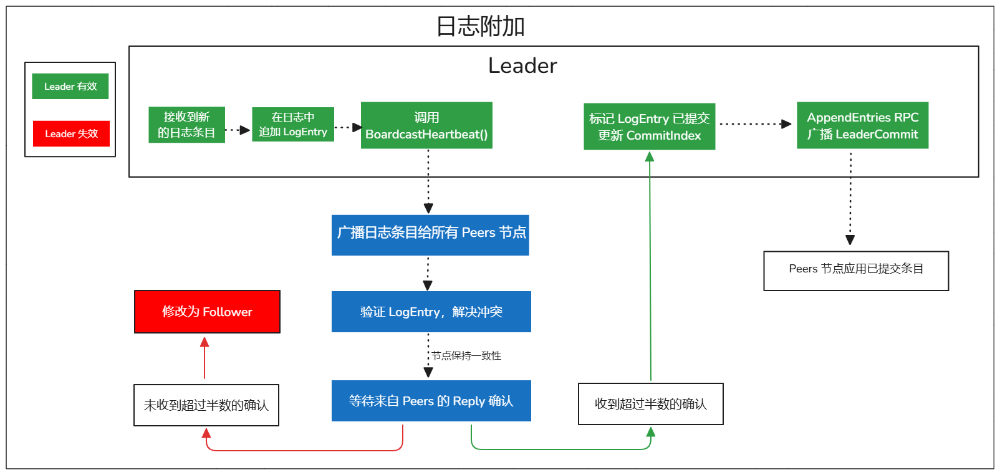

# MIT 6.5840(原6.824) 基于 Raft 算法的分布式系统

Labs of MIT 6.5840(6.824)：Distributed Systems（基于 Raft 算法的分布式系统）

### Lab3 Raft

[实验要求(Experimental Requirements)](http://nil.csail.mit.edu/6.5840/2024/labs/lab-raft.html)



---

Lab3A

1. ✅ 实现 Leader 的选举和心跳(不含日志条目的 AppendEntries RPC);
2. ✅ 实现发送和接收 RequestVote RPC;
3. ✅ 实现心跳 AppendEntries RPC
4. ✅ 避免多个节点同时启动选举
    - 实现**选举定时器**和**心跳计时器**。
    - 实现 ticker() 定时检查选举和心跳的超时
    - 引入条件变量 sync.Cond 来调节 goroutine 的同步。



```bash
12194@kristen MINGW64 ~/AAA-kris/gorepos/6.5840/mit6.5840/src/raft (main)
$ go test -run 3A
Test (3A): initial election ...
  ... Passed --   3.0  3   48   13614    0
Test (3A): election after network failure ...
  ... Passed --   4.6  3  128   23801    0
Test (3A): multiple elections ...
  ... Passed --   5.5  7  658  117606    0
PASS
ok      6.5840/raft     13.324s
```

---

Lab 3B

1. ✅ 补充选举限制（Paper §5.4.1）；
2. ✅ 实现 Start() 函数；
3. ✅ 通过 AppendEntries RPCs 发送和接收新的日志条目；
4. ✅ 通过 applier 协程应用新提交的 LogEntry 并且发送到 peer 的 applyCh 上。



```bash
12194@kristen MINGW64 ~/AAA-kris/gorepos/6.5840/mit6.5840/src/raft (main)
$ go test -run 3B                                                                                                                                      
Test (3B): basic agreement ...
  ... Passed --   0.6  3   16    4532    3
Test (3B): RPC byte count ...
  ... Passed --   1.6  3   48  114400   11
Test (3B): test progressive failure of followers ...
  ... Passed --   4.5  3  127   24558    3
Test (3B): test failure of leaders ...    
  ... Passed --   4.7  3  170   36992    3        
Test (3B): agreement after follower reconnects ...
  ... Passed --   3.7  3   84   21229    7
Test (3B): no agreement if too many followers disconnect ...
  ... Passed --   3.6  5  244   44539    3
Test (3B): concurrent Start()s ...
  ... Passed --   0.6  3   14    3998    6
Test (3B): rejoin of partitioned leader ...
  ... Passed --   5.9  3  155   39691    4
Test (3B): leader backs up quickly over incorrect follower logs ...
  ... Passed --  17.3  5 1634 1259990  102
Test (3B): RPC counts aren't too high ...
  ... Passed --   2.2  3   36   10612   12
PASS
ok      6.5840/raft     44.975s
```

---

Lab3C

1. ✅ 优化 AppendEntries 的回复（返回 peer 和 Leader 之间的冲突日志起始 Index，减少 RPCs 数量）
2. ✅ 实现 readPersist() 恢复 Raft 节点状态
3. ✅ 实现 persist() 持久化 Raft 节点状态


```bash
12194@kristen MINGW64 ~/AAA-kris/gorepos/6.5840/mit6.5840/src/raft (main)
$ go test -run 3C
Test (3C): basic persistence ...
  ... Passed --   5.2  3  115   29575    7
Test (3C): more persistence ...
  ... Passed --  14.9  5  975  189149   16
Test (3C): partitioned leader and one follower crash, leader restarts ...
  ... Passed --   1.5  3   35    8692    4
Test (3C): Figure 8 ...
  ... Passed --  31.4  5 1693  428398   77
Test (3C): unreliable agreement ...       
  ... Passed --   1.6  5  365  125763  246
Test (3C): Figure 8 (unreliable) ...      
  ... Passed --  34.7  5 3338 7353680   51
Test (3C): churn ...
  ... Passed --  16.3  5 6625 9864520 2633
Test (3C): unreliable churn ...
  ... Passed --  16.1  5 2672 1945826  872
PASS
ok      6.5840/raft     121.795s
```

